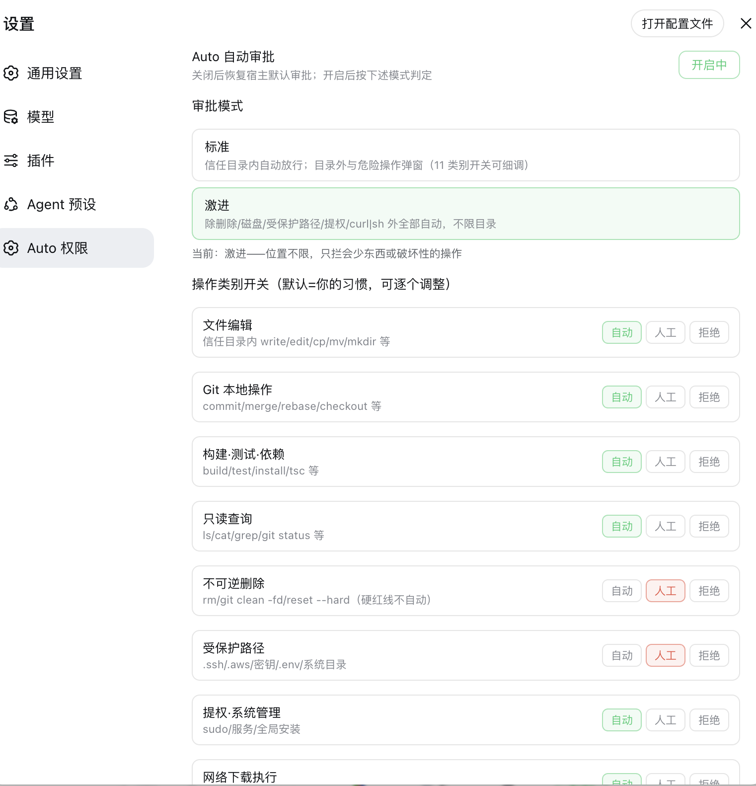

# dsh-perm-guard 🛡️

[English](README.md) | [简体中文](README.zh-CN.md)


[](https://awesome-dsh-plugin.com)

面向 [DeepSeek Harness](https://github.com/deepseek-ai/deepseek-harness)（`dsh`）web 的**「Auto 自动审批」中间档权限插件**——介于 `workspace-write`（弹窗太频繁）与 `danger-full-access`（权限太高）之间。跨目录编辑、`git commit`/`merge`、构建等常规操作**不再弹窗**；破坏性操作（删除、磁盘、提权、`curl|sh`）**一律人工确认**。

*非官方项目：社区成员独立开发维护，非 DeepSeek 官方产品。*

## 截图




## 功能

- **双模式**（设置页切换，持久化）：
  - **标准**：信任目录（工作区、兄弟目录、自定义列表）内自动放行；目录外与危险操作弹窗。
  - **激进**：位置不限，只有破坏性操作仍弹窗。
- **11 个类别三态开关**（自动 / 人工 / 拒绝），默认值即用户个人习惯，可逐个细调。
- **审计**——每次判定记录（放行 / 转人工 / 拒绝）+ 时间 + 命令摘要。
- **配置持久化**——`~/.dsh/perm-guard.json`，重启不丢。零宿主依赖。

## 安装

```sh
dsh plugin --profile web add "github:a903067276-rgb/dsh-perm-guard#main"
```

然后重启 `dsh web`。更新：`dsh plugin --profile web update dsh-perm-guard`，重启。

手动兜底安装：见 [docs/install.md](docs/install.md)。

## 用法

- **Auto 按钮**——输入框工具行左侧。点击开关自动审批（绿色 = 开启）。关闭后完全恢复宿主默认审批行为。
- **设置 → Auto 权限**——总开关、模式选择（标准 / 激进）、11 个类别开关、信任目录编辑、最近判定审计列表。
- 开启时规则作用于**所有会话**（含子代理）。

### 模式默认值

| 类别 | 标准 | 激进 |
|---|---|---|
| 文件编辑（write/edit/cp/mv/mkdir） | 自动（信任目录内） | 自动 |
| Git 本地操作（commit/merge/rebase/checkout） | 自动 | 自动 |
| 构建·测试·依赖 | 自动 | 自动 |
| 只读查询（ls/cat/grep/git status） | 自动 | 自动 |
| **不可逆删除（rm、reset --hard、clean -fd）** | **人工** | **人工** |
| **受保护路径（.ssh/.aws/密钥/.env/系统目录）** | **人工** | **人工** |
| **提权·系统管理（sudo、服务、全局安装）** | 人工 | 人工 |
| **网络下载执行（curl\|sh）** | 人工 | 人工 |
| Git 推送远端 | 人工 | 自动 |
| 发布·部署 | 人工 | 自动 |
| **磁盘·分区·设备** | **人工** | **人工** |

切换模式会重置类别开关为该模式默认值（之后可再细调）。

### 永不自动放行（所有模式）

- 删除：`rm`、`rm -rf /` 或 `~`（断路器，含 `$(...)` 变体）、`git reset --hard`、`git clean -fd`、`Remove-Item`
- 磁盘：`dd` 写设备、`mkfs`/`fdisk`/`wipefs`/`diskutil` 擦盘、写 `/dev/`
- 提权：`sudo`/`su`、系统服务（`launchctl`/`systemctl`）、递归 `chmod`/`chown` 根或家目录
- 网络下载执行：`curl|sh`、`wget|sh`
- 强制推送：`git push --force` / `-f`（重写历史）
- 受保护路径写入

## 平台支持

| 平台 | 状态 |
|---|---|
| macOS | ✅ 开发环境 |
| Linux | ⚠️ 预期可用 |
| Windows | ⚠️ 预期可用 |

## 环境要求

- DSH web（本插件守卫的审批体系所在）
- PATH 里有 `pnpm`——`dsh plugin` 是 pnpm 转发器（安装/更新必需）

## 工作原理

- **宿主弹窗前拦截**——每个审批请求在宿主审批弹窗前被拦截，按"实际命令/目标"分类判定：安全操作自动回答放行（13ms 无感）；危险操作转交人工弹窗。
- **命令级防火墙**（`tools/pre-execute`）——危险类别在沙箱拒绝之前就提前拦截。
- **分类判定管线**——双模式设定各类别默认值（标准：信任目录内自动放行；激进：位置不限），11 个三态开关（自动 / 人工 / 拒绝）逐类细调。
- **审计与持久化**——每次判定记录时间 + 命令摘要；审批决策始终经宿主 `approval/asked` + `approval/decided` 事件对持久化。

## 注意事项

- DSH 沙箱**无 OS 级网络隔离**（不同于 Codex）：插件只能识别命令文本中的下载执行模式（`curl|sh`），无法拦截其他网络行为。
- 终端会话、子代理创建、模型调用、MCP 工具完全不在审批体系内。
- 命令**文本中**含有危险字样（如 echo `"Remove-Item"`、脚本内嵌规则源码）会被保守拦截——预期行为，实际罕见。
- 审计列表为内存态（60 条），重启重置；审批决策本身始终经宿主 `approval/asked` + `approval/decided` 事件对持久化。

## 覆盖范围

- **DSH 全部审批入口已覆盖**：`bash`、`pwsh`（PowerShell）、`write`/`edit` 文件工具。MCP 工具与其他只读工具无审批机制，不受影响。
- **复合命令**（`a && rm -rf x`）：纯词链拆分逐条判定取最严；含变量/重定向/通配的链整体保守处理。
- **未知命令**：无论何种模式一律回退为“ask”（安全默认）——分类器无法解析的命令绝不自动放行。

## 与 Claude Code / Codex 对照

| | Claude Code | Codex | dsh-perm-guard |
|---|---|---|---|
| 只读命令集 | 内置不可配置 | 沙箱 | 内置 + 可配置 |
| `rm -rf / ~` 断路器 | 永远提示 | 沙箱拦截 | 所有模式永远提示 |
| 受保护路径 | 有 | `.git`/`.agents`/`.codex` | `.ssh`/`.aws`/密钥/系统目录/`.git` |
| 网络隔离 | 工具级 | OS 级（默认关） | **不可用**（DSH 无 OS 级断网，仅 `curl\|sh` 模式识别） |
| 审批类别 | 3 类工具 | 5 个细粒度开关 | 11 个显式开关 + 双模式 |
| 审计 | 仅弹窗 | 日志 | 插件内审计 + 宿主 `approval/asked`/`decided` 事件 |

## 配置文件

`~/.dsh/perm-guard.json`（首次修改时创建）：

```json
{
  "enabled": true,
  "mode": "standard",
  "categories": { "fileEdit": "auto", "...": "..." },
  "trustedDirs": []
}
```

- `trustedDirs`：标准模式下额外自动放行的绝对路径（默认含工作区及兄弟目录）。
- 激进模式下忽略信任目录（位置不限）。

## 开发

```sh
# 热插拔测试（免重启）
# 1. 用同源判定逻辑定义动态 Cordis 插件
# 2. cordis_run → 验证 → cordis_stop

# 静态 bundle（本仓库布局）
# 软链到 ~/.dsh/profiles/web/node_modules/dsh-perm-guard
# ~/.dsh/profiles/web/package.json 的 dsh.profile.bundles 加 "dsh-perm-guard"
# 重启 dsh web
```

验证矩阵：[docs/verify-checklist.md](docs/verify-checklist.md)

## 许可证

[MIT](LICENSE)
